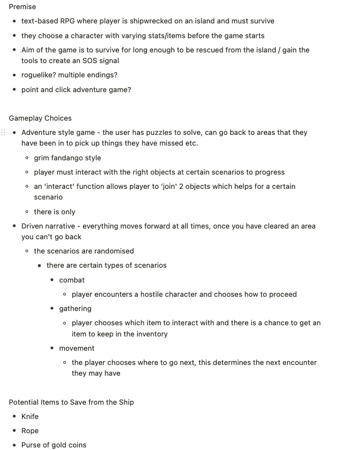

#Shipwrecked

## Project Overview
This project was a pair project and the final project I did during my Software Engineering Immersive course at General Assembly. The project is a text-based RPG where the player’s environment is described to them with descriptive text, and the player types text commands to play the game. 

## Deployment

This project has not been deployed yet.

## How to download:

The projects’ files can be accessed here: [GitHub](https://github.com/sungchun/shipwrecked)

- If you want to clone the repository:
  1. Click the button labeled ‘Code’.
  2. On the dropdown menu select HTTPS and copy the link provided.
  3. Using the terminal, navigate to where you want to clone the repository and execute the command: “git clone (copied HTTPS link)”
- If you want to download the ZIP file:
  1. Click the button labeled ‘Code’
  2.Click the ‘Download ZIP’ button on the dropdown menu.

## Running the App
Due to bugs caused during deployment, if you wish to access a working version of Shipwrecked please download the project from my partner [Simon's Repository](https://github.com/sclemson/Shipwrecked).
Once you have downloaded to game files, to run it in your browser you must follow the following steps:
1.  Navigate to the 'client' directory in your terminal and run the command 'yarn', this will install all dependencies.
2.  In the root directory ('shipwrecked') terminal run the command 'python3 manage.py runserver'.
3.  Navigate back to the 'client' directory and run the command 'yarn start'.
4.  Go to localhost:3000 in your browser and you should see the project.


## Goal and Timeframe:

The goal of this project was to create a web app with full CRUD functionality using Django REST framework and a React frontend. The time frame was 10 days.

## Gameplay

Shipwrecked is a text-based RPG where the player gives text-commands to play the game. The game gives text prompts that describe the players surroundings. The game also lists items that the player can interact with and areas that they can walk to.

With that information, the player has a list of commands that they can use.
The commands are:
- ‘WALKTO’
- ‘PICKUP’
- ‘TALKTO’
- ‘EXAMINE’
- ‘COMBINE’
- ‘USE’
- ‘GIVE’

In the game, the player plays as a character that has been washed on the beach of an unknown island. The objective of the game is to be rescued. 

With the aforementioned commands the player navigates and interacts with the environment, solving puzzles to progress.

## Technology Used:
- HTML5
- CSS
- JavaScript
- Python3
- Django
- PostgreSQL
- PyJWT
- Axios
- Git + GitHub
- React

## Functionality
- Register & login.
- Create a new save.
- Play any of their selected saves.
- Save their game progress.
- Read the descriptive text associated with the zone the player’s in. 
- See the items that the player can interact with in the zone.
- See which zones are accessible from the zone they are in.
- Walk to different zones.
- Examine items.
- Pickup items.
- Combine items.
- Use items.
- Give items.


## Process

### Planning
When my partner and I decided to make a text-based RPG the first thing that we discussed was to use Notion to brainstorm what style of game it should be.

We decided to make it an ‘Adventure’ game inspired by classic point-and-click adventure games such as ‘Day of the Tentacle’ and ‘Monkey Island’. 



Next, we talked about how we would create the game. The first and simplest idea was to manually create each stage of the game individually, and have the game progress through many if statements. 

It was quickly decided that this would be very limiting in terms of gameplay and also very inefficient and time-consuming to create in practice.

To remedy this we decided to create an infrastructure so that all of the gameplay and game content worked in the same way. As a result, any content could be added in easily without writing extra code to make it work.

In order to prove that our infrastructure worked, we created a prototype of the game where the first level was playable. We created a very basic first level which played successfully, after this we went forward with our plan.


My partner set up a Trello board to house all of the game’s content and writing. This was very helpful because we had all of the game’s information centralized in one place which made coding the game’s levels very convenient.

My partner and I distributed the work as follows: We decided that I would work on the game engine, creating the game infrastructure, the gameplay and the save function. My partner worked on creating the game’s content itself and also styling for all the game’s pages. 

We worked together on a Zoom call primarily focusing on our individual tasks but coming together if there were any difficulties. When we worked together I would share my screen so that we could both see the code. At the end of every day we would discuss the next steps of the project so we knew what to work on the next day. We would also outline how we would do so, for the final day we created a list of all the tasks each of us had to do to complete the project. 


### Frontend

#### Game Infrastructure

This was done by using classes for zones and items. The properties for every zone and item included all the information necessary so that they can work inside the game’s infrastructure.

```
    class Item {
        constructor(name, examine, canPickUp, pickUp, combinesWith = [], creates = null, talkTo, use) {
            this.name = name
            this.examine = examine
            this.combinesWith = combinesWith
            this.canPickUp = canPickUp
            this.pickUp = pickUp
            this.creates = creates
            this.talkTo = talkTo
            this.use = use
        }
    }
```


Then, they were stored as key value pairs in objects.


Uses classes standardized the information in the game ensuring that any instance of either class would work in the game.

Storing them in objects allowed them to be accessible easily via their keys.


#### Updating the game
The game’s save feature means that the state of the game is always connected to a save file. This means that as the player plays the game, their previous progress is constantly being updated in the save file. 

```
    async function changeConnections() {
        let nextZone = ''
        for (const place in zones) {
            if (zones[place] === zone.next) {
                nextZone = place
            }
        }
        let config = {
            method: 'get',
            url: `/api/zones/${Number(getZoneID())}/`,
            header: {
                Authorization: `Bearer ${getToken()}`,
                'Content-Type': 'application/json',
            }
        }
        const response = await axios(config)
        const currentZoneObject = response.data
        config = {
            method: 'put',
            url: `/api/zones/${Number(getZoneID())}/`,
            header: {
                Authorization: `Bearer ${getToken()}`,
                'Content-Type': 'application/json',
            },
            data: {
                ...currentZoneObject,
                name: `${nextZone}`
            }
        }
        const updatedZone = await axios(config)
    }
```


This is done using the ‘changeConnections’ function. 

Each ‘phase’ of an area is its own instance of the ‘State’ class.

Whenever a player changes the state of a level this function finds the name of the next zone ‘State’ as a string. It then updates the name of the current zone to that string in the backend. 

The use of strings is necessary because the keys in the ‘Zones’ object are strings. 

When the player goes to an area the game finds the area in the backend and renders the information from the index of the ‘Zone’ object with the ‘name’ of the zone in the backend.

#### User Interactivity

```
    function readCommand(str) {
        const splitCommand = str.split(' ')
        const command = splitCommand.splice(0, 1)
        if (!commands[command[0].toUpperCase()]) {
            if (input.toLowerCase() === zone.solution.toLowerCase()) {
                changeConnections()
                setZone(zone.next)
                return
            } else {
                setSecondText('Command not found')
                return
            }
        }
        commands[command[0].toUpperCase()](splitCommand[0])
    }
```

The user is able to interact with the game via text inputs. All of the possible commands are stored as key value pairs in a ‘commands’ object. The ‘readCommand’ function above takes the user’s input and splits it into an array. The first string in the array is used to index the 
‘commands’ object and runs the function.


For example, the ‘WALKTO’ command’s key is ‘WALKTO’ and its value is a function that updates the current zone that is being rendered.

#### Save Functionality

In order for multiple players to play ‘Shipwrecked’ without having their game data mixed up with other players, their saves must have their own game data. 

When I realized this I decided to have the game clone all of the game data every time a player creates a new save. This way their game files will be independent of other save files. 

```
    export const campTwo = new State(
        'camp',
        'The coconut water has cooled the embers and the grill quickly.',
        null,
        campThree,
        'PICKUP coolgrill',
        [items['coolgrill']],
        'https://i.imgur.com/nFiNUlM.jpg',
        null,
        ['boggyground']
    )
```

Each instance of the ‘State’ class (ie. every zone phase) has a ‘connectedto’ property. This property tracks which other zones the state should have a symmetrical relationship with. 

```
    export const levelOne = ['beach', 'jungleone', 'rockpoolone', 'driftwoodone']
    export const levelTwo = ['pathone', 'shadowymanone', 'caveone', 'rubbishone']
    export const levelThree = ['riverone', 'treeone', 'poolone']
    export const levelFour = ['clearing', 'duckone', 'trackone']
    export const levelFive = ['boggygroundone', 'treesone', 'campone']
    export const levelSix = ['mountainhutone']
    export const levelSeven = ['summitone']
    export const levelEight = ['epilogue']
    export const levels = [levelOne, levelTwo, levelThree, levelFour, levelFive, levelSix, levelSeven, levelEight]
```

When a new save is made the game iterates through the ‘levels’ array and the array for each level. For each iteration it creates a new ‘Zone’ object in the backend. All of the zones made for a save file are iterated over and updated to have relationships with the appropriate zones. The Django ‘Zone’ model includes a ‘manytomany’ relationship with itself, so only one zone for each relationship has to be updated. 

When a player plays the game, the name of the zones stored on the server are updated (eg. from drfitwoodone to driftwoodtwo). When the ‘updateConnections’ function changes the name of the zone, it renders a new area in the game but keeps the same connection in the backend. This is done so that if a player walks back to an area they have already been, the changes they have made will still be present. 

### Backend
Because of the infrastructure that had been designed for the game. The objects in the backend contained a minimal amount of information.

```
    class Game(models.Model):
    name = models.CharField(max_length=100)
    timestamp = models.DateTimeField(auto_now=True)
    user = models.ForeignKey(User, on_delete=models.CASCADE)

    def __str__(self):
        return f"Game:{self.name}"
```

The model for Games (users’ saves) is as shown above. Its primary function is to be connected to the correct user (so a player will see all of their saves) and also for a game’s levels, zones and inventory to be connected to it, so that the progress of that particular save is saved to the right ‘Game’.

```
    class Item(models.Model):
    name = models.CharField(max_length=100)
    game = models.ForeignKey("games.Game", on_delete=models.CASCADE)

    def __str__(self):
        return f'name: {self.name}, save: {self.game}'
```

This is the model for items in the game. Its function is to have the correct name of the item so that I can access the item’s information in the ‘items’ object. It also has a one-to-many relationship with the ‘Game’ model. The game remembers which items are connected to a specific save. This is how the game saves which items a player had in their inventory.

```
    class Zone(models.Model):
    name = models.CharField(max_length=100)
    level = models.ForeignKey('levels.Level', on_delete=models.CASCADE)
    zones = models.ManyToManyField('self', blank=True, symmetrical=True)
    game = models.ForeignKey('games.Game', blank=True, null=True, on_delete=models.CASCADE)

    def __str__(self):
        return f'name: {self.name}, level: {self.level}'
```

The ‘Zone’ model has a name that is also used for indexing. As previously explained, when a ‘Zone’ in the game is changed the name of the zone in the backend is updated so that a different key in the ‘zones’ object is indexed and the new information is accessed. This model includes a many-to-many relationship with itself. This is how the backend records which zones are directly accessible from each zone. Because the many-to-many relationship is symmetrical, only one ‘Zone’ object must have a record for each connection. Finally, the game property is a one-to-many relationship that records which zones are connected to which save.

## Wins/Challenges
The biggest achievements from this project were designing and implementing the game architecture, creating the text-based commands feature, and creating the save feature. 

I am particularly proud of the architecture’s design because I came up with it entirely on my own without any research. Once I understood what kind of game my partner and I were creating, I was able to outline all the problems and challenges we would face when making the game, and I created this infrastructure as a solution. When my partner and I completed the prototype I knew that my idea would work for the entire game and I was very satisfied. 

The text-based commands feature involves a simple system explained above in ‘Process’. However, the commands were quite difficult to code. The ‘COMBINE’ command was the most difficult command to create. This is because there are a lot of things that must be checked before a player can execute a successful ‘COMBINE’ command. For items to combine correctly, all of the items required for the combination must be in the player’s inventory, all of them must be listed in the ‘COMBINE’ command, the command must contain all but ONLY the items necessary for the combination. After these checks are passed, the original items must be removed from the inventory (in the backend as well) and the new item has to be created and added to the player’s inventory. Needless to say this particular command took a lot of time and effort but I was very pleased when I finally completed it.

Finally, the save functionality was challenging because the backend had to be redesigned to include the ‘Game’ model. The other models in the backend also had to include new relationships. The most challenging part of creating the save function was understanding the logic of how it would work. I realized that in order for all players to have their own saves, the entire game would have to be cloned for each save. This is necessary so that players’ save information do not interfere with each other. Updating the backend’s connections and models, and creating the save function was something that I was very proud of because, like the overall structure of the game, I created the solutions myself after outlining the issues and problems we would face. 

## Future Features/Improvements

To improve the game in the future, I would do the following:
I would redesign the game engine so that commands such as ‘USE’ could become more versatile. This would enable options in level and puzzle design, making the gameplay more versatile and diverse.
I would refactor as much of the code as possible. Due to the nature of the game’s infrastructure there are some ‘workarounds’ that limit the game’s functionality. 
For example each zone ‘state’ can only have 1 item that can be picked up at a time. This is because zone ‘state’s are not fluid and can update with any change, they look for 1 specific change and render the subsequent zone ‘state’.

## Key Learnings

My biggest takeaway from the projects was the experience of designing and engineering the architecture of a project. When my partner and I planned the game I realized that the best way to create the game was to design an architecture for all of the game’s information. As opposed to coding each part of the game, this would allow us to ‘plug in’ the game data and all of the interactions and game mechanics would work automatically. 

The content of ‘Shipwrecked’ is so extensive that I believe doing this was necessary to save time and energy. It also enabled the game to be ‘free-roam’ as opposed to completely linear. 
Additionally, creating the ‘save’ function required me to create an infrastructure for how each player’s game information was saved. 

These aspects of the project were the most challenging but also the most fulfilling and interesting. The process of creating these solutions gave me invaluable experience in problem-solving.
